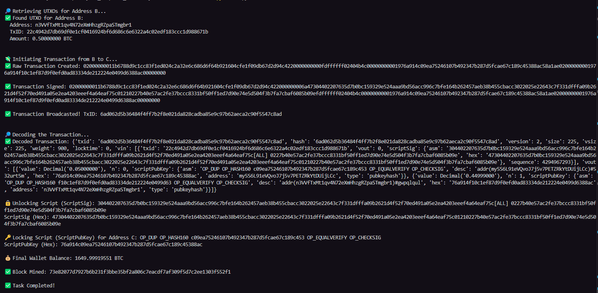

# Team Details

**Team Name -** Blockbros

**Team Member details:-**

1. Dhriti Jha - sse230021007
2. Divyam Maru - cse230001025
3. Abhinav Singh - che230008002

# Question 1

## Screenshots




### Code Snippet 1

```py
    unspent_outputs = wallet_rpc.listunspent()
    if not unspent_outputs:
        raise Exception("No unspent outputs available for spending\n")

    largest_utxo = max(unspent_outputs, key=lambda x: x['amount'])
    total_amount = Decimal(largest_utxo['amount'])
    transaction_fee = Decimal('0.00001')
    transfer_amount = Decimal('0.5')
    change_amount = total_amount - transfer_amount - transaction_fee

    inputs = [{
        "txid": largest_utxo['txid'],
        "vout": largest_utxo['vout']
    }]

    outputs = {address_B: float(transfer_amount)}
    if change_amount > Decimal('0.00000546'):
        outputs[address_A] = float(change_amount)

    raw_transaction = wallet_rpc.createrawtransaction(inputs, outputs)
    print(f"✅ Raw transaction successfully created\n")

except Exception as e:
    print(f"❌ Error while creating transaction: {e}\n")
```

#### Explanation of the Code

1. **Fetching UTXOs**: The `listunspent()` method retrieves all unspent transaction outputs (UTXOs) associated with the wallet. These UTXOs represent funds that are available for spending. The code ensures that at least one UTXO is available; otherwise, it raises an exception.

2. **Calculating Amounts**:

   - `total_amount`: The total amount available in the selected UTXO.
   - `transfer_amount`: The amount to be sent to the recipient address.
   - `transaction_fee`: The fee required to process the transaction on the blockchain network.
   - `change_amount`: The remaining amount after deducting the transfer amount and transaction fee from the total amount.

3. **Creating Inputs and Outputs**:

   - `inputs`: Specifies the UTXO(s) to be spent in the transaction. Each input includes the transaction ID (`txid`) and the output index (`vout`) of the UTXO.
   - `outputs`: Specifies the recipient address and the amount to be transferred. If there is any change, it is sent back to the sender's address.

4. **Creating Raw Transaction**: The `createrawtransaction()` method generates a raw transaction using the specified inputs and outputs. This raw transaction is unsigned and needs to be signed before broadcasting.

5. **Signing the Transaction**: The `signrawtransactionwithwallet()` method signs the raw transaction using the private key(s) associated with the wallet. This step ensures that the transaction is authorized by the owner of the funds.

6. **Broadcasting the Transaction**: The `sendrawtransaction()` method broadcasts the signed transaction to the blockchain network, making it available for miners to include in a block.

7. **Decoding the Transaction**: The `decoderawtransaction()` method decodes the raw transaction to provide a human-readable representation of its details, such as inputs, outputs, and scripts.

8. **Locking Script**: The locking script (`scriptPubKey`) defines the conditions that must be met to spend the funds. It is included in the transaction's outputs and typically contains a cryptographic hash of the recipient's public key.

### Code Snippet 2

```py
print("\n💸 Initiating Transaction from B to C...")
FEE = Decimal('0.00001')
send_amount = Decimal('0.05').quantize(Decimal('0.00000001'), rounding=ROUND_DOWN)
change_amount = Decimal(utxo_B['amount']) - send_amount - FEE

if change_amount <= Decimal('0.00000546'):
    raise ValueError("Insufficient change — adjust send amount or UTXO value.")

inputs = [{"txid": utxo_B['txid'], "vout": utxo_B['vout']}]
outputs = {
    address_C: float(send_amount),
    address_B: float(change_amount)
}

raw_transaction = wallet_rpc.createrawtransaction(inputs, outputs)
print(f"✅ Raw Transaction Created: {raw_transaction}\n")
```

#### Explanation of the Code

1. **Fetching UTXOs**: The `listunspent()` method retrieves all unspent transaction outputs (UTXOs) associated with the wallet. The code filters these UTXOs to find one corresponding to the sender's address.

2. **Calculating Amounts**:

   - `total_amount`: The total amount available in the selected UTXO.
   - `transfer_amount`: The amount to be sent to the recipient's address.
   - `transaction_fee`: The fee required to process the transaction on the blockchain network.
   - `change_amount`: The remaining amount after deducting the transfer amount and transaction fee from the total amount.

3. **Creating Inputs and Outputs**:

   - `inputs`: Specifies the UTXO(s) to be spent in the transaction. Each input includes the transaction ID (`txid`) and the output index (`vout`) of the UTXO.
   - `outputs`: Specifies the recipient address and the amount to be transferred. If there is any change, it is sent back to the sender's address.

4. **Creating Raw Transaction**: The `createrawtransaction()` method generates a raw transaction using the specified inputs and outputs. This raw transaction is unsigned and needs to be signed before broadcasting.

5. **Signing the Transaction**: The `signrawtransactionwithwallet()` method signs the raw transaction using the private key(s) associated with the wallet. This step ensures that the transaction is authorized by the owner of the funds.

6. **Broadcasting the Transaction**: The `sendrawtransaction()` method broadcasts the signed transaction to the blockchain network, making it available for miners to include in a block.

7. **Decoding the Transaction**: The `decoderawtransaction()` method decodes the raw transaction to provide a human-readable representation of its details, such as inputs, outputs, and scripts.

8. **Unlocking Script**: The unlocking script (`scriptSig`) provides the necessary data to satisfy the conditions of the locking script from the referenced UTXO. It typically contains a digital signature and the public key of the sender.

9. **Locking Script**: The locking script (`scriptPubKey`) defines the conditions that must be met to spend the funds. It is included in the transaction's outputs and typically contains a cryptographic hash of the recipient's public key.

### Decoded Scripts for Transactions

#### Transaction 1

**Unlocking Script (scriptSig):**

- `asm`: The unlocking script contains the hash of the public key (`00141ec774325912bb16be1b7d89056efe08d475992c`) that matches the locking script's condition.
- `hex`: The hexadecimal representation of the unlocking script (`1600141ec774325912bb16be1b7d89056efe08d475992c`).

**Locking Script for Address B:**

- `asm`: The locking script uses `OP_HASH160` to hash the public key and `OP_EQUAL` to ensure it matches the provided hash (`OP_HASH160 683897bab503841ef95f12e6e54ed97fca3cf337 OP_EQUAL`).
- `hex`: The hexadecimal representation of the locking script (`a914683897bab503841ef95f12e6e54ed97fca3cf33787`).

#### Transaction 2

**Unlocking Script (scriptSig):**

- `asm`: The unlocking script contains the hash of the public key (`0014e27237dfb950414ea473149a4adc17972f91ace1`) that matches the locking script's condition.
- `hex`: The hexadecimal representation of the unlocking script (`160014e27237dfb950414ea473149a4adc17972f91ace1`).

**Locking Script for Address C:**

- `asm`: The locking script uses `OP_HASH160` to hash the public key and `OP_EQUAL` to ensure it matches the provided hash (`OP_HASH160 b8cf71d88132816cb409bd335938cfbfeadb6edd OP_EQUAL`).
- `hex`: The hexadecimal representation of the locking script (`a914b8cf71d88132816cb409bd335938cfbfeadb6edd87`).

**Locking Script for Address B (Change):**

- `asm`: The locking script uses `OP_HASH160` to hash the public key and `OP_EQUAL` to ensure it matches the provided hash (`OP_HASH160 683897bab503841ef95f12e6e54ed97fca3cf337 OP_EQUAL`).
- `hex`: The hexadecimal representation of the locking script (`a914683897bab503841ef95f12e6e54ed97fca3cf33787`).

### Validation of Transactions

The challenge and response scripts ensure the validity of transactions by utilizing cryptographic mechanisms. Here's how they work:

1. **Unlocking Script (scriptSig)**: This script provides the necessary data (e.g., a digital signature and public key) to satisfy the conditions of the locking script from the referenced UTXO.

2. **Locking Script (scriptPubKey)**: This script defines the conditions that must be met to spend the funds, such as requiring a valid signature that matches the public key hash.

3. **Validation Process**: When a transaction is broadcasted, nodes validate it by executing the unlocking and locking scripts together. If the combined execution returns `true`, the transaction is valid.

4. **Example**: In Transaction 1, the unlocking script satisfies the locking script for Address B. In Transaction 2, the unlocking script satisfies the locking script for Address C.

### Explanation of `OP_EQUAL` and `OP_HASH160`

1. **`OP_HASH160`**: This operation applies SHA-256 followed by RIPEMD-160 to produce a 160-bit hash, commonly used for public key hashes.

2. **`OP_EQUAL`**: This operation checks if the two topmost items on the stack are equal, returning `true` if they match.

### Combined Usage in Locking Scripts

- A common pattern is `OP_HASH160 <hash> OP_EQUAL`, where `<hash>` is the expected value. The unlocking script must provide an input that, when hashed, matches `<hash>`. This ensures only the rightful owner can spend the funds.

This mechanism ensures that only the rightful owner of the funds can spend them, maintaining the integrity and security of the blockchain.

# Question 2

## Screenshots


### Code Snippet 1

Here, we have the transaction created to send from address A to B. This was done using the code:-

```py
    utxos = wallet_rpc.listunspent()
    utxo = next((u for u in utxos if u['address'] == address_A), None)
    if not utxo:
        raise Exception(f"No spendable UTXO found for {address_A}\n")

    total_amount = Decimal(utxo['amount'])
    transfer_amount = Decimal('0.3')
    transaction_fee = Decimal('0.00001')
    change_amount = total_amount - transfer_amount - transaction_fee

    inputs = [{"txid": utxo['txid'], "vout": utxo['vout']}]
    outputs = {address_B: float(transfer_amount)}

    if change_amount > Decimal('0.00000546'):
        outputs[address_A] = float(change_amount)

    raw_transaction = wallet_rpc.createrawtransaction(inputs, outputs)
    print(f"✅ Raw transaction created\n")

    signed_transaction = wallet_rpc.signrawtransactionwithwallet(raw_transaction)
    if not signed_transaction.get('complete'):
        raise Exception("Transaction signing failed\n")

    txid = wallet_rpc.sendrawtransaction(signed_transaction['hex'])
    print(f"✅ Transaction broadcasted successfully! TxID: {txid}\n")

    decoded_transaction = wallet_rpc.decoderawtransaction(signed_transaction['hex'])
    print(f"✅ Decoded Transaction:\n{decoded_transaction}\n")

    for vout in decoded_transaction['vout']:
        if vout['scriptPubKey']['address'] == address_B:
            print(f"🔐 Locking Script for Address B': {vout['scriptPubKey']['asm']}\n")
```

#### Explanation of the Code

1. **Fetching UTXOs**: The `listunspent()` method retrieves all unspent transaction outputs (UTXOs) associated with the wallet. The code filters these UTXOs to find one corresponding to `address_A`.

2. **Calculating Amounts**:

   - `total_amount`: The total amount available in the selected UTXO.
   - `transfer_amount`: The amount to be sent to `address_B`.
   - `transaction_fee`: The fee for processing the transaction.
   - `change_amount`: The remaining amount after deducting the transfer amount and transaction fee.

3. **Creating Inputs and Outputs**:

   - `inputs`: Specifies the UTXO to be spent.
   - `outputs`: Specifies the recipient (`address_B`) and the change back to `address_A` (if applicable).

4. **Creating Raw Transaction**: The `createrawtransaction()` method generates a raw transaction using the specified inputs and outputs.

5. **Signing the Transaction**: The `signrawtransactionwithwallet()` method signs the raw transaction using the wallet's private key.

6. **Broadcasting the Transaction**: The `sendrawtransaction()` method broadcasts the signed transaction to the blockchain network.

7. **Decoding the Transaction**: The `decoderawtransaction()` method decodes the transaction to verify its details.

8. **Locking Script**: The code extracts and prints the locking script (`asm`) for `address_B` from the transaction's outputs.

This process ensures a secure and valid transfer of funds from `address_A` to `address_B`.

### Code Snippet 2

```py
    utxos = wallet_rpc.listunspent()
    utxo_B = next((u for u in utxos if u['address'] == address_B), None)
    if not utxo_B:
        raise Exception(f"No spendable UTXO found for {address_B}\n")

    total_amount = Decimal(utxo_B['amount'])
    transfer_amount = Decimal('0.2')
    transaction_fee = Decimal('0.00001')
    change_amount = total_amount - transfer_amount - transaction_fee

    inputs = [{"txid": utxo_B['txid'], "vout": utxo_B['vout']}]
    outputs = {address_C: float(transfer_amount)}

    if change_amount > Decimal('0.00000546'):
        outputs[address_B] = float(change_amount)

    raw_transaction = wallet_rpc.createrawtransaction(inputs, outputs)
    print(f"✅ Raw transaction created\n")

    signed_transaction = wallet_rpc.signrawtransactionwithwallet(raw_transaction)
    if not signed_transaction.get('complete'):
        raise Exception("Transaction signing failed\n")

    txid = wallet_rpc.sendrawtransaction(signed_transaction['hex'])
    print(f"✅ Transaction broadcasted successfully! TxID: {txid}\n")

    decoded_transaction = wallet_rpc.decoderawtransaction(signed_transaction['hex'])
    print(f"✅ Decoded Transaction:\n{decoded_transaction}\n")

    for vin in decoded_transaction['vin']:
        print(f"🔒 Unlocking Script (scriptSig): {vin['scriptSig']['asm']}")
        print(f"ScriptSig (Hex): {vin['scriptSig']['hex']}\n")

    for vout in decoded_transaction['vout']:
        if vout['scriptPubKey']['address'] == address_C:
            print(f"🔑 Locking Script for Address C': {vout['scriptPubKey']['asm']}")
            print(f"ScriptPubKey (Hex): {vout['scriptPubKey']['hex']}\n")
```

#### Explanation of the Code

1. **Fetching UTXOs**: The `listunspent()` method retrieves all unspent transaction outputs (UTXOs) associated with the wallet. The code filters these UTXOs to find one corresponding to `address_B`.

2. **Calculating Amounts**:

   - `total_amount`: The total amount available in the selected UTXO.
   - `transfer_amount`: The amount to be sent to `address_C`.
   - `transaction_fee`: The fee for processing the transaction.
   - `change_amount`: The remaining amount after deducting the transfer amount and transaction fee.

3. **Creating Inputs and Outputs**:

   - `inputs`: Specifies the UTXO to be spent.
   - `outputs`: Specifies the recipient (`address_C`) and the change back to `address_B` (if applicable).

4. **Creating Raw Transaction**: The `createrawtransaction()` method generates a raw transaction using the specified inputs and outputs.

5. **Signing the Transaction**: The `signrawtransactionwithwallet()` method signs the raw transaction using the wallet's private key.

6. **Broadcasting the Transaction**: The `sendrawtransaction()` method broadcasts the signed transaction to the blockchain network.

7. **Decoding the Transaction**: The `decoderawtransaction()` method decodes the transaction to verify its details.

8. **Unlocking Script**: The code extracts and prints the unlocking script (`scriptSig`) for the input UTXO.

9. **Locking Script**: The code extracts and prints the locking script (`asm`) for `address_C` from the transaction's outputs.

This process ensures a secure and valid transfer of funds from `address_B` to `address_C`.

Now if you look at the output:-

```sh
✅ Decoded Transaction:
{'txid': '541a4cfdf4ac1f8afde2c9580b5357ec6f70adb6c18c1f7a6c9981b2c6200e72', 'hash': '0fc1b3320b5c656ace2adf5c78353d3961ab737fd4590a70aff1ecda0e573eea', 'version': 2, 'size': 247, 'vsize': 166, 'weight': 661, 'locktime': 0, 'vin': [{'txid': 'c8e7f57146f20e13927bed2c38f109505e5b6829b486e6198439f50a0c13f25e', 'vout': 1, 'scriptSig': {'asm': '00141ec774325912bb16be1b7d89056efe08d475992c', 'hex': '1600141ec774325912bb16be1b7d89056efe08d475992c'}, 'txinwitness': ['3044022005cb75881917545dc10c019c5017b83eae98cac1f42e444237d80fcbf2f58d7102202c4f2c0837150428ecd330a8710c7459a052db192dba00008d8db8e314152efa01', '0265895a224ec3cadfbbc314a02bd8ad110e7fbd41a202f0d30114e3b68e86be0a'], 'sequence': 4294967293}], 'vout': [{'value': Decimal('0.30000000'), 'n': 0, 'scriptPubKey': {'asm': 'OP_HASH160 683897bab503841ef95f12e6e54ed97fca3cf337 OP_EQUAL', 'desc': 'addr(2N2kJ4N3CFEKvNXTHJ6UZn2cW1qvYCsGCSy)#4hygk7vs', 'hex': 'a914683897bab503841ef95f12e6e54ed97fca3cf33787', 'address': '2N2kJ4N3CFEKvNXTHJ6UZn2cW1qvYCsGCSy', 'type': 'scripthash'}}, {'value': Decimal('0.19999000'), 'n': 1, 'scriptPubKey': {'asm': 'OP_HASH160 89b984bc457d914a07fc8da712b1216c0ad0f819 OP_EQUAL', 'desc': 'addr(2N5oSocgDtLyQ5trfj9VUFQ5Yay6euoc3uT)#sxcv2kdc', 'hex': 'a91489b984bc457d914a07fc8da712b1216c0ad0f81987', 'address': '2N5oSocgDtLyQ5trfj9VUFQ5Yay6euoc3uT', 'type': 'scripthash'}}]}

🔐 Locking Script for Address B': OP_HASH160 683897bab503841ef95f12e6e54ed97fca3cf337 OP_EQUAL

✅ Block mined: 3d4612e07982411530706c36b3c9437ad2c8d40e6e8d8a20a9c3630cda0d359b

✅ Raw transaction created

✅ Transaction broadcasted successfully! TxID: 50574de0c9ea310fe8e7c999d0c81c7ef4c1463b27e51ba640808d3067bd9121

✅ Decoded Transaction:
{'txid': '50574de0c9ea310fe8e7c999d0c81c7ef4c1463b27e51ba640808d3067bd9121', 'hash': '41c1b9625e2c56b05de433fa5bfc6d98fc15f416742b7e5af435cd38faaf8822', 'version': 2, 'size': 247, 'vsize': 166, 'weight': 661, 'locktime': 0, 'vin': [{'txid': '541a4cfdf4ac1f8afde2c9580b5357ec6f70adb6c18c1f7a6c9981b2c6200e72', 'vout': 0, 'scriptSig': {'asm': '0014e27237dfb950414ea473149a4adc17972f91ace1', 'hex': '160014e27237dfb950414ea473149a4adc17972f91ace1'}, 'txinwitness': ['304402201fce8aa59f0e9e1fe8865ec23da6fe1eee9b14328aac9d55789f7c044b82474202203d38e45f2d6267a2d42f3e02f3b338c3198517b0ec90a5d8055da48105fdcb2c01', '0312e51fc48adf880d833c9a99a8ab6e82ce55f9aabd35bc5bb775313f637e5c61'], 'sequence': 4294967293}], 'vout': [{'value': Decimal('0.20000000'), 'n': 0, 'scriptPubKey': {'asm': 'OP_HASH160 b8cf71d88132816cb409bd335938cfbfeadb6edd OP_EQUAL', 'desc': 'addr(2NA6Qq6HKhpYZcLoi3xPr7qPvQ8TwKmC674)#daygkk0t', 'hex': 'a914b8cf71d88132816cb409bd335938cfbfeadb6edd87', 'address': '2NA6Qq6HKhpYZcLoi3xPr7qPvQ8TwKmC674', 'type': 'scripthash'}}, {'value': Decimal('0.09999000'), 'n': 1, 'scriptPubKey': {'asm': 'OP_HASH160 683897bab503841ef95f12e6e54ed97fca3cf337 OP_EQUAL', 'desc': 'addr(2N2kJ4N3CFEKvNXTHJ6UZn2cW1qvYCsGCSy)#4hygk7vs', 'hex': 'a914683897bab503841ef95f12e6e54ed97fca3cf33787', 'address': '2N2kJ4N3CFEKvNXTHJ6UZn2cW1qvYCsGCSy', 'type': 'scripthash'}}]}
```

Here we can see that the `'txid'` of the prior transaction is seen in the `'vin'` field of the second transaction, namely `'541a4cfdf4ac1f8afde2c9580b5357ec6f70adb6c18c1f7a6c9981b2c6200e72'`.

### Decoded Scripts for Transactions

#### Transaction 1

**Unlocking Script (scriptSig):**

- `asm`: `00141ec774325912bb16be1b7d89056efe08d475992c`
- `hex`: `1600141ec774325912bb16be1b7d89056efe08d475992c`

**Locking Script for Address B:**

- `asm`: `OP_HASH160 683897bab503841ef95f12e6e54ed97fca3cf337 OP_EQUAL`
- `hex`: `a914683897bab503841ef95f12e6e54ed97fca3cf33787`

#### Transaction 2

**Unlocking Script (scriptSig):**

- `asm`: `0014e27237dfb950414ea473149a4adc17972f91ace1`
- `hex`: `160014e27237dfb950414ea473149a4adc17972f91ace1`

**Locking Script for Address C:**

- `asm`: `OP_HASH160 b8cf71d88132816cb409bd335938cfbfeadb6edd OP_EQUAL`
- `hex`: `a914b8cf71d88132816cb409bd335938cfbfeadb6edd87`

**Locking Script for Address B (Change):**

- `asm`: `OP_HASH160 683897bab503841ef95f12e6e54ed97fca3cf337 OP_EQUAL`
- `hex`: `a914683897bab503841ef95f12e6e54ed97fca3cf33787`

### Validation of Transactions

The challenge and response scripts ensure the validity of transactions by utilizing cryptographic mechanisms. Here's how they work:

1. **Unlocking Script (scriptSig)**:

   - This script is included in the input of a transaction.
   - It provides the necessary data to satisfy the conditions of the locking script from the referenced UTXO.
   - Typically, it contains a digital signature and the public key of the sender.

2. **Locking Script (scriptPubKey)**:

   - This script is included in the output of a transaction.
   - It defines the conditions that must be met to spend the funds.
   - For example, it may require a valid signature that matches the public key hash.

3. **Validation Process**:

   - When a transaction is broadcasted, nodes in the blockchain network validate it by executing the unlocking script and locking script together.
   - The unlocking script must provide the correct inputs to satisfy the locking script.
   - If the combined execution returns `true`, the transaction is considered valid.

4. **Example**:
   - In Transaction 1, the unlocking script (`00141ec774325912bb16be1b7d89056efe08d475992c`) satisfies the locking script (`OP_HASH160 683897bab503841ef95f12e6e54ed97fca3cf337 OP_EQUAL`) for Address B.
   - In Transaction 2, the unlocking script (`0014e27237dfb950414ea473149a4adc17972f91ace1`) satisfies the locking script (`OP_HASH160 b8cf71d88132816cb409bd335938cfbfeadb6edd OP_EQUAL`) for Address C.
